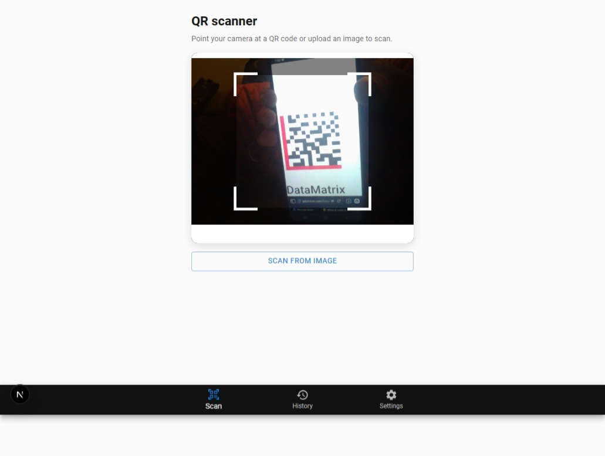

📱 QR Scanner App
A fast, modern QR scanner built with Next.js, featuring:

Real‑time camera scanning

Scan from image upload

Local scan history

Minimal, clean UI

PWA support (installable on mobile & desktop)

Offline capability

Responsive mobile‑first design

🖼️ Screenshot
Add your screenshot here

Code

🚀 Features
🔍 Real‑Time QR Scanning
Uses the device camera to scan QR codes instantly through an isolated iframe scanner for maximum stability.

🖼️ Scan From Image
Upload any image containing a QR code and decode it instantly.

🕒 Local Scan History
Every scan is saved locally on the device — no backend, no tracking, fully private.

📱 PWA Support
Install the app on your home screen and use it offline.

🎨 Clean, Minimal UI
Designed with MUI for a polished, modern feel.

📂 Fully Client‑Side
No server required. Everything runs in the browser.

🛠️ Tech Stack
Next.js  (App Router)

React

MUI (Material UI)

html5-qrcode

next-pwa

LocalStorage

PWA Manifest + Service Worker

📦 Installation
Clone the repository:

bash
git clone https://github.com/your-username/qr-scanner-app.git
cd qr-scanner-app
Install dependencies:

bash
npm install
Run the development server:

bash
npm run dev
Build for production:

bash
npm run build
npm start
📁 Project Structure
Code
src/
  app/
    components/
      QRScanner.js
      BottomNav.js
    context/
      HistoryContext.js
    history/
      page.js
    settings/
      page.js
    page.js
public/
  qr-standalone.html
  manifest.json
  icons/
    icon-192.png
    icon-512.png
📱 PWA Support
This app includes:

manifest.json

Service worker via next-pwa

App icons

Standalone display mode

Offline caching

To install:

On mobile: open the app → “Add to Home Screen”

On desktop: click the install icon in the browser address bar

🔒 Privacy
All scan data is stored locally on your device using localStorage.
No data is uploaded or transmitted anywhere.

🤝 Contributing
Pull requests are welcome!
If you have ideas for improvements, feel free to open an issue.

📄 License
MIT License — free to use, modify, and distribute.
